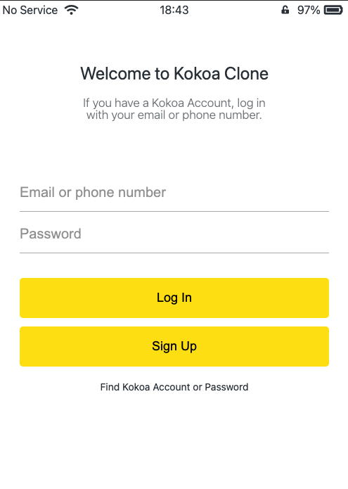
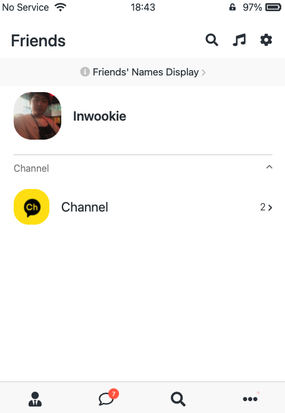
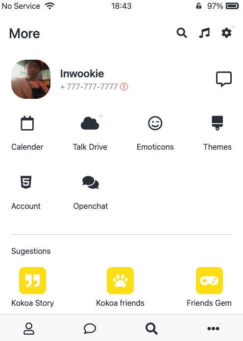
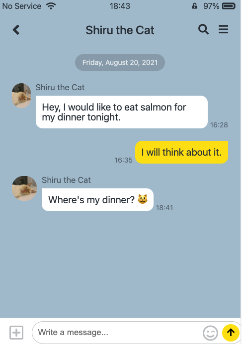
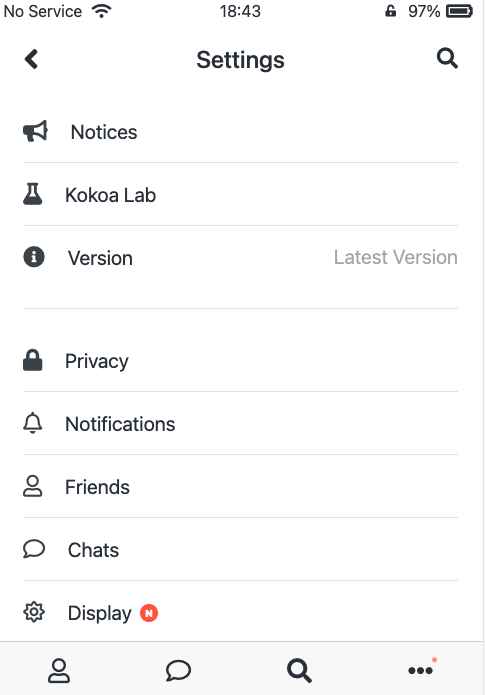
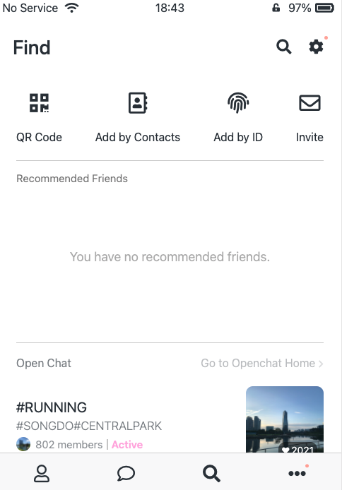

# Kakao Clone | HTML & CSS

Kakao Talk is dominant sms provider in South Korea. This project only used HTML and CSS in order to clone the pages of the App.
 

## Demo

[Kakao Clone Demo](https://inwookie.github.io/kokoa-clone-2021/)

## Stack

### Front-end

 

## Theory

- IDs & Classes
- HTML Tags
- Semantic & non-semantic tags
- Box Model
- Inline, Block, inline-block
- CSS Position
- Flexbox
- Selectors
- Pseudo Selectors
- Transitions
- Animations
- Media Queries
